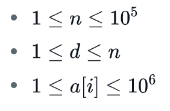

# Left Rotation

A left rotation operation on an array shifts each of the array's elements `1` unit to the left. For example, if `2` left rotations are performed on array `[1, 2, 3, 4, 5]`, then the array would become `[3, 4, 5, 1, 2]`.

Given an array `a` of `n` integers and a number, `d`, perform `d` left rotations on the array. Return the updated array to be printed as a single line of space-separated integers.

### Function Description

Complete the function rotLeft in the editor below. It should return the resulting array of integers.

rotLeft has the following parameter(s):

- An array of integers `a`.
- An integer `d`, the number of rotations.

### Input Format
The first line contains two space-separated integers `n` and `d`, the size of `a` and the number of left rotations you must perform.
The second line contains `n` space-separated integers `a[i]`.

### Constraints


### Output Format
Print a single line of `n` space-separated integers denoting the final state of the array after performing `d` left rotations.

### Sample Input
```shell
5 4
1 2 3 4 5
```

### Sample Output
```shell
5 1 2 3 4
```

### Explanation
When we perform `d = 4` left rotations, the array undergoes the following sequence of changes:

