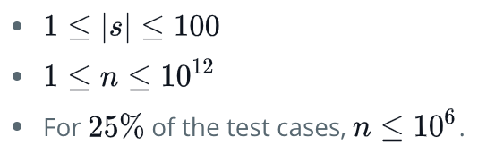

# Repeated String

Lilah has a string, `s`, of lowercase English letters that she repeated infinitely many times.

Given an integer, `n`, find and print the number of letter a's in the first `n` letters of Lilah's infinite string.

For example, if the string `s = 'abcac'` and `n = 10`, the substring we consider is `abcacabcac`, the first `10` characters of her infinite string. There are `4` occurrences of a in the substring.

### Function Description

Complete the repeatedString function in the editor below. It should return an integer representing the number of occurrences of a in the prefix of length  in the infinitely repeating string.

repeatedString has the following parameter(s):

- s: a string to repeat
- n: the number of characters to consider

### Input Format

The first line contains a single string, `s`.
The second line contains an integer, `n`.

### Constraints


### Output Format

Print a single integer denoting the number of letter a's in the first `n` letters of the infinite string created by repeating `s` infinitely many times.

### Sample Input 0
```shell
aba
10
```

### Sample Output 0
```shell
7
```

### Explanation 0
The first `n = 10` letters of the infinite string are abaabaabaa. Because there are `7` a's, we print `7` on a new line.

### Sample Input 1
```shell
a
1000000000000
```

### Sample Output 1
```shell
1000000000000
```

### Explanation 1
Because all of the first `n = 1000000000000` letters of the infinite string are a, we print `1000000000000` on a new line.
